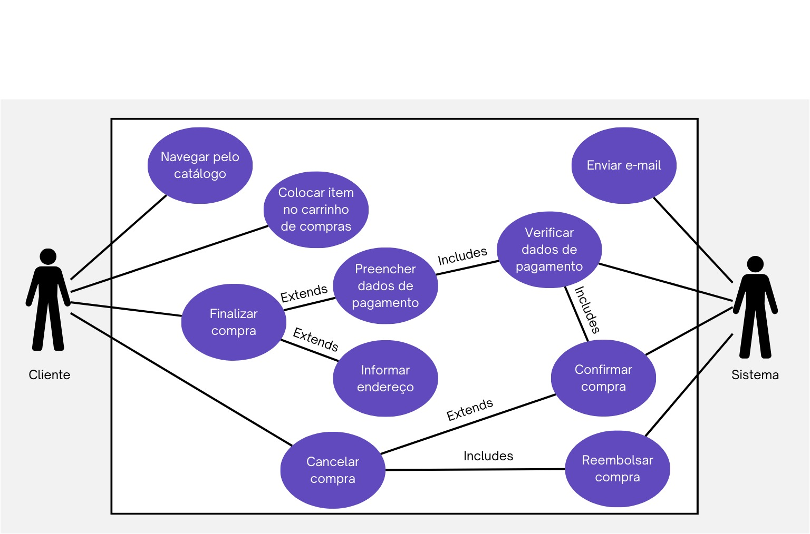

# BestVinhos

## Sobre o sistema
Descrição: O BestVinhos é uma plataforma abrangente dedicada a entusiastas de vinho, oferecendo uma experiência única e personalizada para todo tipo de usuário.

É natal, você decide comprar um vinho de presente para seus pais. Você pesquisa na internet mas fica chocado com os preços! Por sorte, lembra que seu amigo tinha recomendado um site de vinhos bom e barato. E então, você decide fazer uma busca no site bestvinhos.com.br

## Diagrama de casos de uso

## Fotos do sistema

## Jira

